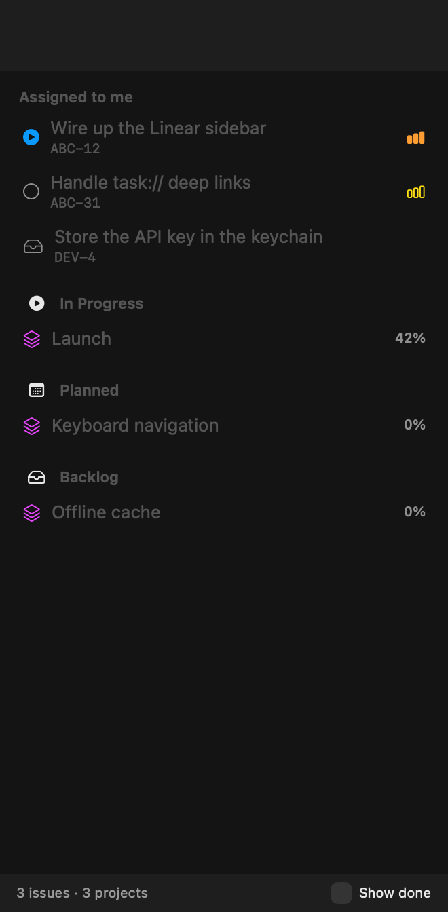
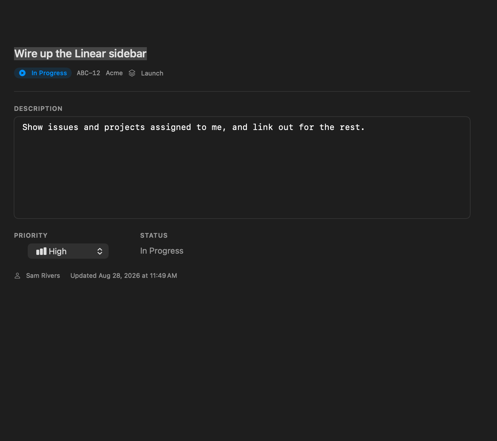

# Tasks

A native macOS app for your work in one window: [`dex`](https://www.npmjs.com/package/@zeeg/dex)
tasks and the Linear issues and projects assigned to you. List on the left, the
thing you picked on the right, editable in place.

| dex tasks | Linear |
| --- | --- |
|  |  |
|  |  |

## dex tasks

- **Browse** the task tree, with subtasks nested under their parent and a
  `done/total` count on every branch.
- **Search** descriptions, context, results and IDs. A parent stays visible when one
  of its subtasks matches, so nothing hides.
- **Filter** by ready / blocked / pending / completed, and sort by priority, created,
  updated or name.
- **Edit** description, context and priority, then Save — only the fields you changed
  are sent.
- **Edit dependencies**: add and remove blockers, and reparent a task. The pickers
  leave out anything that would make a cycle, so `dex` never has to reject it.
- **Mark as done** with a result, and reopen a task you finished too early.
- **Start** a task, complete it with a result (and optionally a commit SHA), reopen
  one you finished too early, and archive what is done.
- **Follow along**: the window refreshes when anything else changes a task, so the
  CLI or an agent editing the same store shows up immediately.

## Linear

Switch the source at the top of the sidebar.

- **Assigned to me**: the issues assigned to you and the projects you lead or belong
  to, without opening a browser. Projects are grouped by status, active work first.
- **Show done** includes completed and cancelled issues *and* projects; with it off
  they are hidden. Paused projects always stay — that work is coming back.
- **Edit in passing**: an issue's title, description, priority and status; a
  project's name, description and target date.
- **Link out for the rest.** Linear has far more depth than this app should copy.
  Every issue and project opens on the website with one click, and the toolbar links
  to the bulk views — **My Issues**, **Created by Me**, **All Projects**, and a Linear
  search pre-filled with whatever you typed in the sidebar.

**Nothing to set up if you use the [`linear` CLI](https://github.com/schpet/linear-cli).**
If it is installed and logged in, the app borrows its key. It asks the CLI
(`linear auth token`) rather than reading `~/.config/linear/credentials.toml`, so it
keeps working after `linear auth migrate` moves the credential into the system
keyring.

Otherwise, put a personal API key in **Settings → Linear** (linear.app → Settings →
Security & access). A key entered there is kept in your login keychain, never in
preferences, and takes precedence over the CLI's.

## Links

The app registers the `task://` scheme, so a link opens the app and selects the item:

| Link | Opens |
| --- | --- |
| `task://dex/4cmymvmd` | that dex task |
| `task://4cmymvmd` | the same, shorthand |
| `task://linear/ABC-12` | that Linear issue |
| `task://linear/project/<id>` | that Linear project |

Try it with `open "task://dex/<some-id>"`. macOS registers the scheme the first time
it sees the app, so move it to `/Applications` and launch it once before relying on
links. A link to something not currently loaded says so rather than doing nothing.

## Install

Download the zip from [Releases](../../releases), unzip it, and drag
**Tasks.app** to `/Applications`.

The build is not signed with an Apple Developer certificate, so the first launch
needs **right-click → Open**, or:

```sh
xattr -dr com.apple.quarantine "/Applications/Tasks.app"
```

Requires macOS 14 or later and [`dex`](https://www.npmjs.com/package/@zeeg/dex)
**0.16 or newer**:

```sh
npm install -g @zeeg/dex
```

dex 0.16 renamed the task fields (the old `description` became `name`, the old
`context` became `description`) and moved storage from `tasks/<id>.json` to a single
`tasks.jsonl`. dex migrates an older store on first run and leaves the previous
directory behind as `tasks.bak`. The app reads both shapes, so a store written by an
older dex still displays correctly, but it needs the 0.16 command line to make
changes — and says so plainly if it finds an older one.

## How it talks to dex

Every read and write goes through the `dex` CLI rather than the JSON on disk, so
`dex` stays the only writer: it keeps `blockedBy` and `blocks` in step on both tasks,
maintains `parent_id`/`children`, and refuses dependency cycles.

There is exactly one exception. `dex` has no un-complete command, so **Reopen**
rewrites `completed`, `completed_at` and `result` in the task's JSON file directly —
the same thing the
[VS Code extension](https://github.com/ryan953/vscode-dex-tasks) does. No
relationship fields are touched, so nothing `dex` keeps in sync can drift.

### Finding dex

A launched `.app` inherits only `/usr/bin:/bin:/usr/sbin:/sbin`, and `dex` is a Node
script with a `#!/usr/bin/env node` shebang — under that `PATH` it fails with
`env: node: No such file or directory` and the app would look empty for no visible
reason. So at startup the app asks your login shell for its `PATH` and runs `dex`
with it. That covers Homebrew, nvm, fnm, volta, mise and asdf without special cases.

If your setup still needs a nudge, set an explicit path in **Settings (⌘,)**, along
with a storage path if you want to work against a store other than the configured
one.

## Keyboard

| | |
| --- | --- |
| `⌘N` | New task |
| `⌘R` | Refresh |
| `⌘S` | Save changes |
| `⌘↩` | Mark as done / create the task |
| `⌘,` | Settings |

## Building

```sh
swift build            # debug
swift test             # unit, integration and view-snapshot suites
Scripts/bundle.sh      # dist/Tasks.app
Scripts/bundle.sh --version 1.2.3 --universal
```

The app icon is drawn by `Scripts/make-icon.swift` at bundle time, so no binary
artwork is kept in the repository.

### Tests

- `Tests/DexKitTests` — decoding, argument building, the task tree, and an
  integration suite that drives the real `dex` binary against a temporary store
  (skipped when `dex` is not installed). Set `DEX_UI_TEST_BIN` to test against a
  specific dex without disturbing the one on your PATH.
- `Tests/LinearKitTests` — the GraphQL layer against recorded responses, through an
  injectable transport, so no network or workspace is involved. Plus a read-only
  live smoke suite that borrows a token from the `linear` CLI and runs the real
  queries; it skips itself when the CLI is absent, so CI never touches a workspace.
- `Tests/DexUITests` — renders the real views into an offscreen window and writes
  PNGs to `.build/snapshots`, so a layout regression is visible rather than
  described.

## Releasing

Push a tag. The workflow builds a universal binary, bundles it, and attaches the zip
to a GitHub release.

```sh
git tag v0.1.0 && git push origin v0.1.0
```

## Licence

MIT
